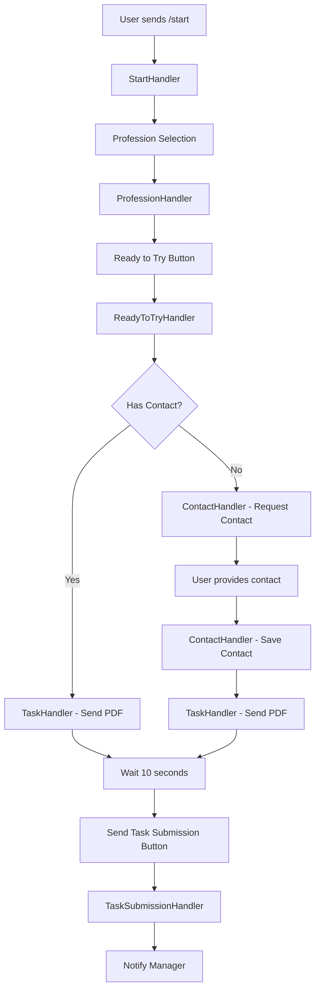
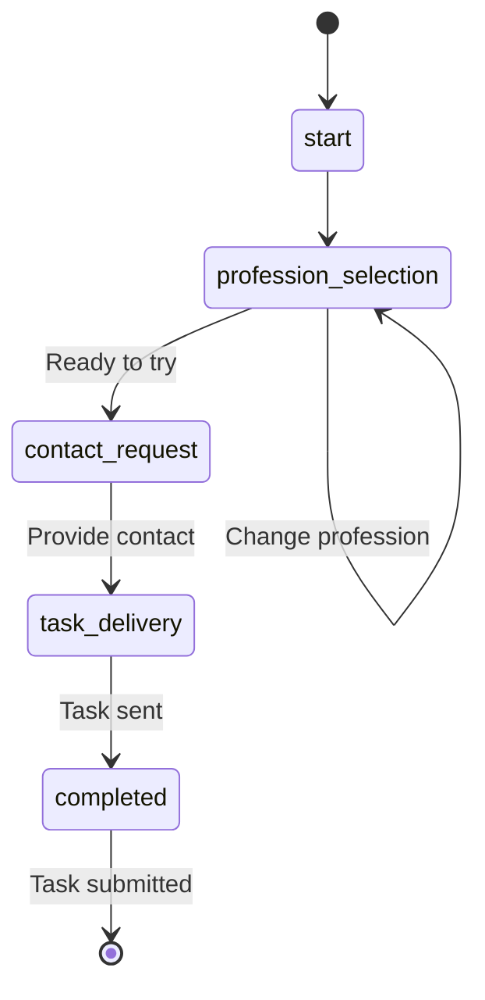

# Архітектура SkillKlan Telegram Bot

## 🏗️ Загальна архітектура

```
┌─────────────────┐    ┌─────────────────┐    ┌─────────────────┐
│   Telegram      │    │   Node.js       │    │   PostgreSQL    │
│   Bot API       │◄──►│   Server        │◄──►│   Database      │
└─────────────────┘    └─────────────────┘    └─────────────────┘
                              │
                              ▼
                       ┌─────────────────┐
                       │   PDF Files     │
                       │   (QA/BA tasks) │
                       └─────────────────┘
```

## 📊 Діаграма потоку даних



## 🧩 Компонентна архітектура

### 1. Bot Layer (bot/)
```
bot/
├── bot.js                 # Main bot class
├── handlers/              # Command handlers
│   ├── BaseHandler.js     # Base class for all handlers
│   ├── StartHandler.js    # /start command
│   ├── ProfessionHandler.js # Profession selection
│   ├── ReadyToTryHandler.js # Ready to try button
│   ├── ContactHandler.js  # Contact collection
│   ├── TaskHandler.js     # PDF task delivery
│   ├── TaskSubmissionHandler.js # Task submission
│   ├── FAQHandler.js      # FAQ
│   ├── RestartHandler.js  # Restart flow
│   └── UnknownHandler.js  # Unknown commands
├── services/              # Business logic
│   ├── UserStateService.js # User state management
│   ├── ContactService.js  # Contact management
│   └── TaskService.js     # Task management
├── templates/             # Message templates
│   ├── messages.js        # Text templates
│   └── keyboards.js       # Keyboard templates
└── types/                 # Data types
    └── index.js           # Type definitions
```

### 2. Shared Layer (shared/)
```
shared/
├── database/              # Database layer
│   └── DatabaseService.js # Database operations
└── utils/                 # Utilities
    └── (future utilities)
```

### 3. Assets Layer (assets/)
```
assets/
└── tasks/                 # PDF task files
    ├── qa-test-task.pdf   # QA test task
    └── ba-test-task.pdf   # BA test task
```

## 🔄 Потік станів користувача



### Стани користувача:
- `start` - Початковий стан
- `profession_selection` - Вибір професії
- `contact_request` - Запит контакту
- `task_delivery` - Доставка завдання
- `completed` - Завершено

## 🗄️ Модель даних

### UserState
```javascript
class UserState {
  constructor(userId, telegramId, username) {
    this.userId = userId;                    // ID в БД
    this.telegramId = telegramId;            // Telegram ID
    this.username = username;                // Telegram username
    this.currentStep = BotStep.START;        // Поточний крок
    this.selectedProfession = null;          // Вибрана професія
    this.contactData = null;                 // Контактні дані
    this.taskSent = false;                   // Завдання відправлено
    this.lastActivity = new Date();          // Остання активність
    this.createdAt = new Date();             // Дата створення
  }
}
```

### ContactData
```javascript
class ContactData {
  constructor(phoneNumber, firstName, lastName) {
    this.phoneNumber = phoneNumber;          // Номер телефону
    this.firstName = firstName;              // Ім'я
    this.lastName = lastName;                // Прізвище
    this.createdAt = new Date();             // Дата створення
  }
}
```

## 🔧 Паттерни проектування

### 1. Handler Pattern
Кожна команда має свій обробник:
```javascript
class BaseHandler {
  async handle(ctx, userState) {
    // Загальна логіка
    if (!this.validateState(userState)) {
      return this.handleInvalidState(ctx, userState);
    }
    return this.execute(ctx, userState);
  }
  
  async execute(ctx, userState) {
    // Абстрактний метод
  }
  
  validateState(userState) {
    // Валідація стану
  }
}
```

### 2. Service Layer Pattern
Бізнес-логіка винесена в сервіси:
```javascript
class UserStateService {
  async getState(telegramId) { /* ... */ }
  async updateState(telegramId, updates) { /* ... */ }
  async setProfession(telegramId, profession) { /* ... */ }
}
```

### 3. Template Pattern
Повідомлення та клавіатури винесені в шаблони:
```javascript
class MessageTemplates {
  static getWelcomeMessage() { /* ... */ }
  static getContactRequestMessage() { /* ... */ }
}

class KeyboardTemplates {
  static getProfessionKeyboard() { /* ... */ }
  static getContactKeyboard() { /* ... */ }
}
```

## 🔄 Життєвий цикл запиту

1. **Отримання повідомлення** - Telegram Bot API
2. **Маршрутизація** - bot.js визначає обробник
3. **Валідація стану** - BaseHandler.validateState()
4. **Виконання логіки** - Handler.execute()
5. **Оновлення стану** - UserStateService.updateState()
6. **Збереження в БД** - DatabaseService.saveUserState()
7. **Відправка відповіді** - ctx.reply()

## 🚀 Масштабування

### Горизонтальне масштабування:
- Кілька екземплярів бота
- Балансувальник навантаження
- Спільна база даних

### Вертикальне масштабування:
- Оптимізація запитів до БД
- Кешування (якщо потрібно)
- Асинхронна обробка

## 🔒 Безпека

### 1. Валідація даних:
- Перевірка типів
- Санітизація вводу
- Валідація телефонних номерів

### 2. Обробка помилок:
- Try-catch блоки
- Graceful degradation
- Логування помилок

### 3. Захист від спаму:
- Rate limiting
- Валідація стану
- Перевірка дозволів

## 📊 Моніторинг

### Логування:
- Всі критичні операції
- Помилки та винятки
- Метрики продуктивності

### Метрики:
- Кількість користувачів
- Конверсія по кроках
- Час відгуку
- Помилки

## 🔮 Майбутні покращення

1. **Кешування** - Redis для швидкості
2. **Черги** - Bull/Agenda для асинхронних задач
3. **Аналітика** - Google Analytics/Mixpanel
4. **Адмін-панель** - Веб-інтерфейс для менеджерів
5. **Тести** - Unit та integration тести
6. **CI/CD** - Автоматичне розгортання
